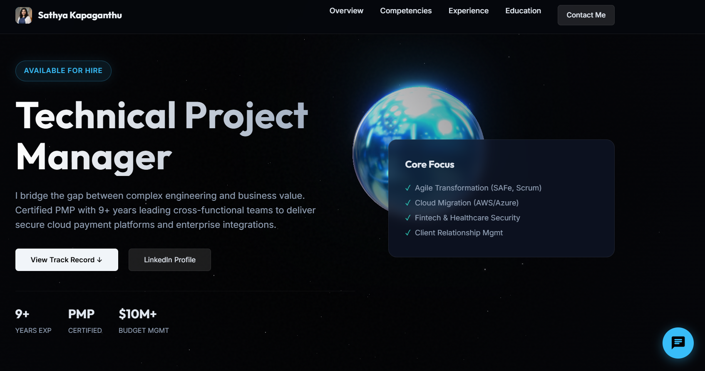

<!-- 🌟 TOP BANNER -->

  

<h1 align="center">👋 Hi, I'm Sathya Kapaganthu</h1>
<h3 align="center">Technical Project Manager | IT Project & Program Delivery</h3>

  <a href="https://github.com/<SathyaKapaganthu>">
    &label=Profile%20Views&style=flat&color=blue" alt="Profile views" />
  </a>
  <a href="https://github.com/<YOUR_GITHUB_USERNAME>?tab=followers">
    ?label=Followers&style=flat" alt="GitHub Followers" />
  </a>
  <a href="https://github.com/<YOUR_GITHUB_USERNAME>?tab=repositories">
    
  </a>
  

---

## 🧑‍💼 About Me

I’m a **Technical Project Manager / IT Project Manager** with **9+ years** of experience delivering **fintech and healthcare IT** projects across cloud, APIs, and enterprise platforms.

- 🚀 Lead cross-functional teams (engineering, QA, product, business)
- 📈 Drive end-to-end delivery, timelines, and stakeholder communication
- ☁️ Comfortable working with **AWS / Azure**, APIs, and data tools
- 📊 Use **data-driven decision making** with SQL, Excel, Power BI & Tableau
- 🎯 Certified **PMP** with strong Agile (Scrum, Kanban, SAFe) background

---

## 🧰 Tech & Tools

### 📋 Project & Delivery

- Jira • Confluence • Asana • Trello • Monday.com • MS Project • Slack

### 🧠 Methodologies

- Agile (Scrum, Kanban, SAFe) • SDLC • Risk & Dependency Management • Release Planning

### 🧑‍💻 Technical & Data

- Cloud: **AWS, Azure**  
- Data: **SQL, Excel, Power BI, Tableau**  
- Web basics: **HTML, CSS, JavaScript**  
- Integration: **APIs, Web Services, ETL**

---

## 💼 Experience Snapshot

### 🔹 Technical Project Manager – Mastercard
- Managing cloud-based, secure payment platforms
- Coordinating multi-team delivery across engineering, QA, infra & business
- Improving system reliability, scalability, and compliance

### 🔹 Project Manager – Centene (Healthcare)
- Led healthcare modernization initiatives
- Streamlined delivery processes and defect triage
- Improved cross-team communication and reporting

### 🔹 Associate PM / BA – Charter, NY State Dept of Taxation, MaxisIT
- Managed feature delivery, sprints, releases, and change requests
- Prepared BRDs, FRDs, user stories, acceptance criteria
- Worked closely with dev, QA, and operations

---

## 🎓 Education & Certification

- 🎓 **Master’s in Finance**, University of Bridgeport  
- 🎓 **Bachelor’s in Accounts**, Osmania University  
- 🏅 **PMP – Project Management Professional**

---

## 🌐 Portfolio Website

My interactive portfolio website showcases:

- 🎨 Modern, minimal UI with **3D WebGL / Three.js** background  
- 🧊 Animated **icosahedron** & particle field  
- 💬 Built-in **chatbot assistant** answering FAQs about my skills, roles & education  
- 📱 Responsive layout for desktop & mobile  

🔗 **Live Demo:** _Add your portfolio URL here_  
💻 **Source Code:** This repository’s `index.html`

---

## 🖼️ Live Demo Screenshots

> Place your screenshots in an `assets/` folder and update the paths below.

  

---

## 📊 GitHub Analytics

> Replace `<YOUR_GITHUB_USERNAME>` with your actual GitHub username.

  &show_icons=true&theme=radical" 
    alt="GitHub Stats" 
    height="160"
  />
  &layout=compact&theme=radical" 
    alt="Top Languages" 
    height="160"
  />

  &theme=radical" 
    alt="GitHub Streak" 
    height="160"
  />

---

## 📫 Contact

- 📍 Saint Louis, MO  
- 📧 **deepthi.ks93@gmail.com**  
- 🔗 **LinkedIn:** [Sathya Kapaganthu](https://www.linkedin.com/in/sathya-kapaganthu-bbb236a0/)  

---

## ⭐ Support

If you like this portfolio or my work:

- ⭐ Star this repo  
- 🔁 Share with your network  
- 🤝 Connect with me on LinkedIn  

> _“I bridge the gap between complex engineering and business value through structured delivery, clear communication, and accountable leadership.”_
